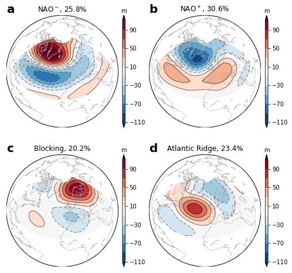

# xlearn: xarray-aware scikit-learn

## Example

    from xlearn.cluster import KMeans
    import xarray as xr
    import numpy as np
  
    da = xr.DataArray(np.random.randn(100, 2, 3))
    m = KMeans(n_clusters=4, random_state=0).fit(da)

## Notebook Examples
[North Atlantic Weather Regimes](http://nbviewer.jupyter.org/github/wy2136/xlearn/blob/master/examples/North_Atlantic_weather_regimes.ipynb)

